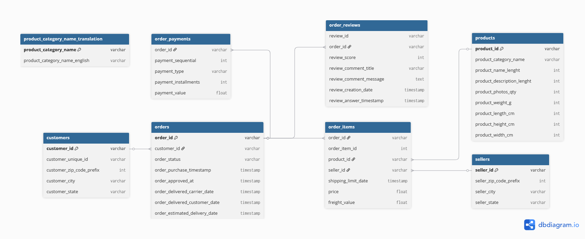

# Analytics Project for "OnnyAnalytics"

Welcome to the project repository for an e-commerce data analysis based on the public Olist dataset.

## 📝 Project Description

**"BrazAnalytics"** is a fictional analytics company that helps businesses make data-driven decisions.

In this project, we are conducting a comprehensive analysis of data from the Brazilian marketplace, Olist. The goal is to identify key performance metrics, understand customer behavior, evaluate logistics processes, and find growth opportunities for the business.

## 🏛️ Database Architecture

To meet the requirements of a relational database and to facilitate analysis, the original flat dataset was normalized. The schema below describes the tables and the relationships between them.


*<p align="center">A screenshot of my ER Diagram </p>*

## 🛠️ Tools and Technologies

* **Database:** PostgreSQL
* **Programming Language:** Python 3.11
* **Key Python Libraries:**
    * `pandas` - for data processing during import.
    * `psycopg2-binary` (for PostgreSQL) - for connecting to the database.
    * `sqlalchemy` - for easier interaction with the DB.
* **Version Control:** Git & GitHub

***
## 📈 Data Analysis: SQL Queries and Results

This section presents the results of executing SQL queries against the database, from basic exploration to complex analytical questions.

##### 4. Basic Queries
These are examples of basic queries used for the initial exploration of the data.

1. (SELECT, LIMIT)
View the first 10 rows of the orders table

2. (GROUP BY, COUNT)
Group and count: number of orders per status

3. (JOIN)
Join tables: show client city for each order

### 5. Run the Analysis Script

The main script, `main.py`, connects to the database, executes several SQL queries, prints the results to the terminal, and saves them to `.csv` files.

1.  **Configure Connection:** Before running, open `main.py` and enter your database connection details in the `DB_CONFIG` dictionary.
2.  **Run the script:** Execute the following command in your terminal:
    
    ```bash
    python main.py
    ```
